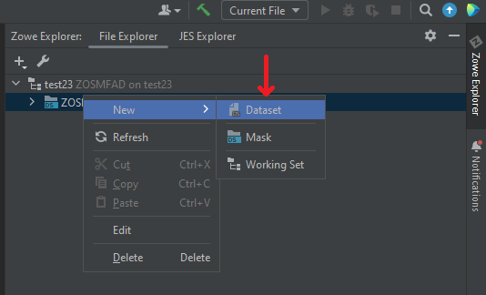
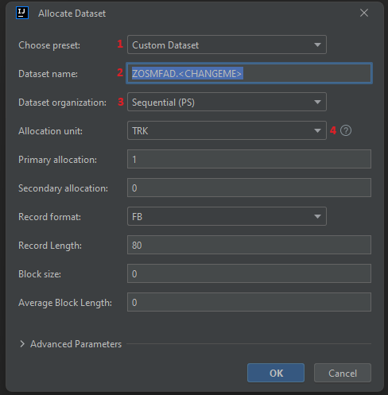
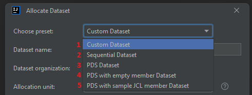
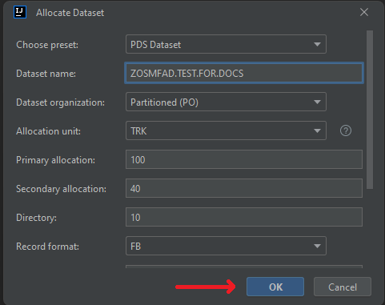
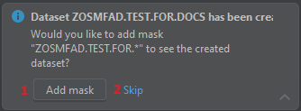
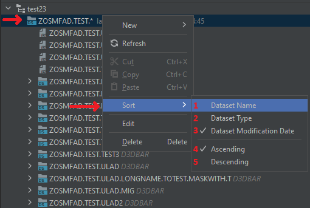
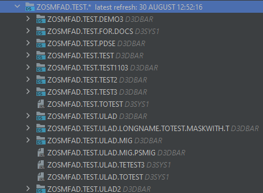

# Working with z/OS Datasets

Using the plug-in, it is possible to:
- create, rename, view, edit, delete PS, PDS, PDS/e datasets, as well as PDS and PDS/e members
- use the feature **Allocate Like** to create a dataset with parameters of the other dataset
- use the feature **Migrate** and **Recall** for archived datasets
- submit JCL jobs with **Submit Job** option
- copy, move z/OS Datasets, both inside the filesystem, and between them, as well as between systems with different IP address
- sort datasets

After you set up a [Files Working Set](./intellij-working-sets.md#files-working-set) and create a mask to display datasets on the z/OS part, it is possible to manipulate PS, PDS and PDS/E datasets

## Allocating a dataset

To allocate a dataset:
1. Right-click on any entity, related to z/OS datasets (it could be **Files Working Set**, **z/OS Datasets mask**, any **other dataset or member**)
2. Select **New** -> **Dataset**

3. Specify the necessary fields. There are some custom options to help with specifying the dataset parameters:
    - **Choose preset (1)** - the option provides the most commonly used dataset presets both for PS and PDS options. Selecting on of the presets will automatically setup all the necessary fields to create the selected type of a dataset (the presets are described more later)
    - **Dataset name (2)** - the name of the dataset to be created. It automatically provides the template of the dataset name with the user's HLQ as the starting string and **.\<CHANGEME\>** string that is intended to be changed by the user
    - **Dataset organization (3)** - the dataset organization to be used. The options are: **PS (Physical Sequential)**, **PO (Partitioned Organization)** and **PO-E (Partitioned Organization - Extended)**
    - **Allocation unit hint (4)** - a small UI improvement hint for better understanding the allocation units and their relative values to each other

All the other parameters are the same as the z/OS provides to allocate a new dataset. In the **Advanced Parameters** section, there are some additional fields to setup if your prefer to set yourself such things as **Volume**, **Device Type**, **Storage class**, etc.

If you want to choose a preset, there are 5 options available for now:
  - **Custom Dataset (1)** - all the fields are set by the user
  - **Sequential Dataset (2)** - the fields are set to allocate a template PS dataset
  - **PDS Dataset (3)** - the fields are set to allocate a template PDS dataset
  - **PDS with empty member Dataset (4)** - the fields are set to allocate a template PDS dataset with an empty member inside
  - **PDS with sample JCL member Dataset (5)** - the fields are set to allocate a template PDS dataset with a member with a template JCL job inside

4. After specifying all the necessary fields, click **OK**

5. When the dataset is allocated, the plug-in will suggest creating a mask to display the dataset created under. Click **Add mask (1)** to add the mask and **Skip (2)** to skip the mask creation

## Working with z/OS PS datasets

Here you can see a possible scenario of working with PS datasets

## Working with z/OS PDS / PDS/E datasets

Here you can see a possible scenario of working with PDS / PDS/E datasets

## "Allocate Like" feature

To issue the **Allocate Like**, right-click on any of datasets and select **Allocate Like**.

## "Submit Job" feature

To issue the **Submit Job**, right-click on any of PS datasets or PDS / PDS/E members and select **Submit Job**.

## Sort a datasets mask

To sort z/OS datasets list:
1. Right click on a datasets mask, select **Sort**. The list of sorting options will appear:
    - **Dataset Name (1)** - to sort by dataset names
    - **Dataset Type (2)** - to sort by dataset types (PS / PO / PO-E)
    - **Dataset Modification Date (3)** - to sort by dataset modification date and time. Datasets list is sorted by this option by default

Also, there is a possibility to change the order for the items to be displayed: **Ascending (4)** (by default) or **Descending (5)**. For the example purposes, select **Dataset Name**

2. The list will be refreshed with the new sort order

